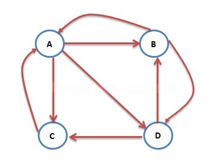
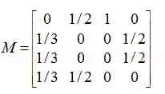
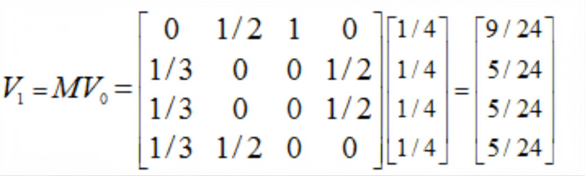
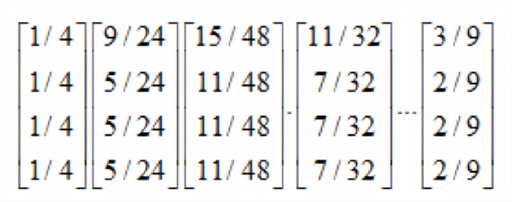
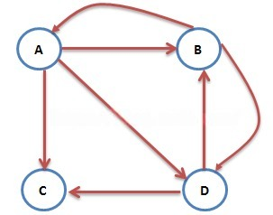
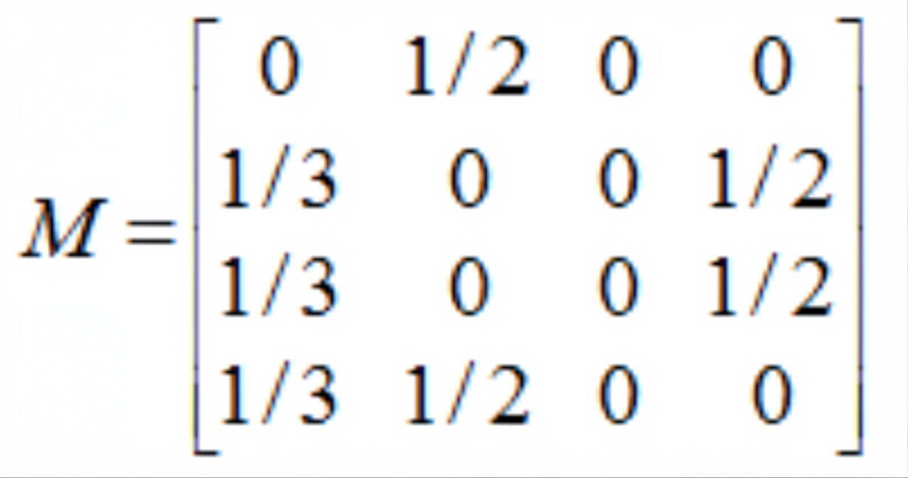
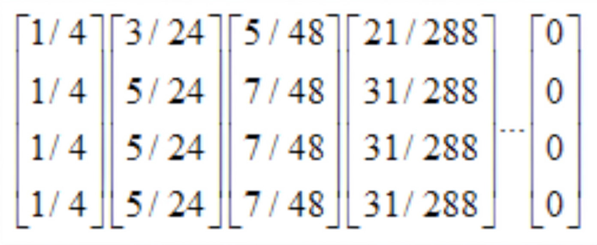
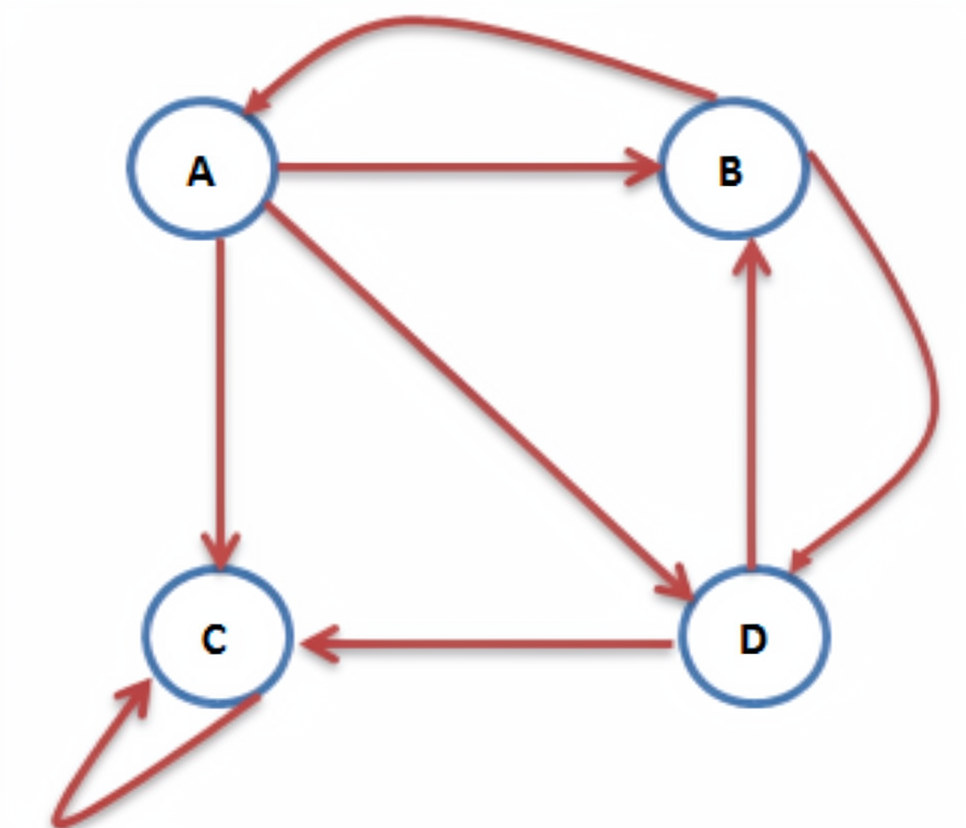
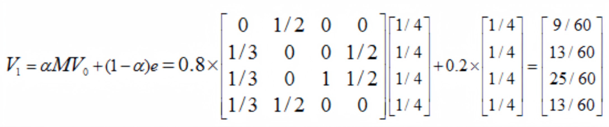
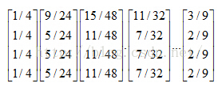

# 什么是pagerank
PageRank算法计算每一个网页的PageRank值，然后根据这个值的大小对网页的重要性进行排序。它的思想是模拟一个悠闲的上网者，上网者首先随机选择一个网页打开，然后在这个网页上呆了几分钟后，跳转到该网页所指向的链接，这样无所事事、漫无目的地在网页上跳来跳去，PageRank就是估计这个悠闲的上网者分布在各个网页上的概率。

PageRank核心思想：
如果一个网页被很多其他网页链接到的话说明这个网页比较重要，也就是PageRank值会相对较高

如果一个PageRank值很高的网页链接到一个其他的网页，那么被链接到的网页的PageRank值会相应地因此而提高
互联网中的网页可以看出是一个有向图，其中网页是结点，如果网页A有链接到网页B，则存在一条有向边A->B，下面是一个简单的示例：

这个例子中只有四个网页，如果当前在A网页，那么悠闲的上网者将会各以1/3的概率跳转到B、C、D，这里的3表示A有3条出链，如果一个网页有k条出链，那么跳转任意一个出链上的概率是1/k，同理D到B、C的概率各为1/2，而B到C的概率为0。一般用转移矩阵表示上网者的跳转概率，如果用n表示网页的数目，则转移矩阵M是一个n*n的方阵；如果网页j有k个出链，那么对每一个出链指向的网页i，有M[i][j]=1/k，而其他网页的M[i][j]=0；上面示例图对应的转移矩阵如下：

初试时，假设上网者在每一个网页的概率都是相等的，即1/n，于是初试的概率分布就是一个所有值都为1/n的n维列向量V0，用V0去右乘转移矩阵M，就得到了第一步之后上网者的概率分布向量MV0,（nXn）*(nX1)依然得到一个nX1的矩阵。下面是V1的计算过程：

注意矩阵M中M[i][j]不为0表示用一个链接从j指向i，M的第一行乘以V0，表示累加所有网页到网页A的概率即得到9/24。得到了V1后，再用V1去右乘M得到V2，一直下去，最终V会收敛，即Vn=MV(n-1)，上面的图示例，不断的迭代，最终V=[3/9,2/9,2/9,2/9]‘：

终止点问题

上述上网者的行为是一个马尔科夫过程的实例，要满足收敛性，需要具备一个条件：

图是强连通的，即从任意网页可以到达其他任意网页：
互联网上的网页不满足强连通的特性，因为有一些网页不指向任何网页，如果按照上面的计算，上网者到达这样的网页后便走投无路、四顾茫然，导致前面累计得到的转移概率被清零，这样下去，最终的得到的概率分布向量所有元素几乎都为0。假设我们把上面图中C到A的链接丢掉，C变成了一个终止点，得到下面这个图：

对应的转移矩阵为：

连续迭代下去，最终所有元素都为0：

陷阱问题

另外一个问题就是陷阱问题，即有些网页不存在指向其他网页的链接，但存在指向自己的链接。比如下面这个图：

上网者跑到C网页后，就像跳进了陷阱，陷入了漩涡，再也不能从C中出来，将最终导致概率分布值全部转移到C上来，这使得其他网页的概率分布值为0，从而整个网页排名就失去了意义。如果按照上面图对应的转移矩阵为：

不断的迭代下去，就变成了这样：

解决终止点问题和陷阱问题
上面过程，我们忽略了一个问题，那就是上网者是一个悠闲的上网者，而不是一个愚蠢的上网者，我们的上网者是聪明而悠闲，他悠闲，漫无目的，总是随机的选择网页，他聪明，在走到一个终结网页或者一个陷阱网页（比如两个示例中的C），不会傻傻的干着急，他会在浏览器的地址随机输入一个地址，当然这个地址可能又是原来的网页，但这里给了他一个逃离的机会，让他离开这万丈深渊。模拟聪明而又悠闲的上网者，对算法进行改进，每一步，上网者可能都不想看当前网页了，不看当前网页也就不会点击上面的连接，而上悄悄地在地址栏输入另外一个地址，而在地址栏输入而跳转到各个网页的概率是1/n。假设上网者每一步查看当前网页的概率为a，那么他从浏览器地址栏跳转的概率为(1-a)，于是原来的迭代公式转化为：

V = aMV + (1-a)e

现在我们来计算带陷阱的网页图的概率分布：

重复迭代下去，得到：

# 数学公式与推导
1. 基本数学公式
$$PR(A) = (1-d) + d \left( \frac{PR(T_1)}{C(T_1)} + \frac{PR(T_2)}{C(T_2)} + \cdots + \frac{PR(T_n)}{C(T_n)} \right)$$

其中：

PR(A)：页面A的PageRank值
d：阻尼系数（damping factor），通常设置为0.85
T1...Tn：所有指向页面A的页面
C(Ti)：页面Ti的出链数量
1-d：随机跳转概率

2. 完整PageRank公式
考虑随机游走模型，完整的PageRank公式可以表示为:
$$PR(p_i) = \frac{1-d}{N} + d \sum_{j \in B_i} \frac{PR(p_j)}{L(p_j)}$$

其中：

N：网页总数
PR(pⱼ)：页面pⱼ的PageRank值
L(pⱼ)：页面pⱼ的出链数量
∑：对所有链接到页面pᵢ的页面求和

3. 矩阵表示
PageRank可以用线性代数的形式表示：
$$\mathbf{R} = d \mathbf{M} \mathbf{R} + (1-d) \frac{\mathbf{v}}{N}$$

其中：

R：PageRank向量
M：转移矩阵（adjacency matrix）
v：单位向量
d：阻尼系数
N：页面总数

# pagerank模型
随机游走模型
PageRank算法基于随机游走模型（Random Walk），该模型可以这样理解：
想象一个随机上网者，他按照以下规则上网：

85%的时间，他点击当前页面的链接继续浏览
15%的时间，他随机跳转到其他页面

随机游走的数学原理
在随机游走框架下，PageRank值代表：

1. 长期访问概率：一个随机访问者在经过足够长时间的访问后，停留在某个页面的概率
2. 马尔可夫链稳态分布：PageRank是马尔可夫链的稳态分布

数学推导过程
定义转移概率：

从页面i到页面j的转移概率为 P(i→j) = 1/L(i)（如果存在链接）
随机跳转概率为 (1-d)/N

转移矩阵构造：

$$M = d * A + (1-d) * B$$
其中：
A：原始转移矩阵
B：随机跳转矩阵
d：阻尼系数

求解稳态分布：
通过求解 R = M * R 得到PageRank向量

迭代计算方法

PageRank通常通过迭代计算来求解：

初始化：所有页面的PageRank值设为1/N
迭代更新：
 $$PR_{new}(A) = \frac{(1-d)}{N} + d * ∑\frac{PR_old(T)}{L(T)}$$

收敛判断：当相邻两次迭代的变化小于设定阈值时停止